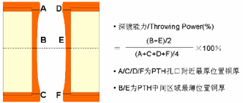

# SG2042_EVB_V2_0_CAM PCB 线路板制作技术要求

## 单板技术信息

- 板名: SG2042_EVB_V2_0
- 层数: $16$ 层
- 板厚: $2.00\mathrm{mm}$
- 单元板尺寸: $243.84\mathrm{mm} \times 304.8 \mathrm{mm}$
- 拼接板数量: 1X1
- 拼板尺寸: $257.84\mathrm{mm} \times 304.8\mathrm{mm}$
- 板材型号: IT-170GRA2
- 阻抗控制: 是
- 表面处理方式: ENIG
- 文字丝印颜色: 白色
- 阻焊油墨颜色: 绿色
- PCB加工等级: IPC 2级
- 外形加工方式: 锣板
- 特殊工艺: 树脂塞孔、背钻、POFV 

## 光绘/gerber文件说明

### 文件参数

- 光绘文件格式: Gerber RS274X
- 精度: $2.5\mathrm{mm}$

### 文件清单

- [ART01.art](./ART01.art): 线路和蚀刻层
- [ART02.art](./ART02.art): 线路和蚀刻层
- [ART03.art](./ART03.art): 线路和蚀刻层
- [ART04.art](./ART04.art): 线路和蚀刻层
- [ART05.art](./ART05.art): 线路和蚀刻层
- [ART06.art](./ART06.art): 线路和蚀刻层
- [ART07.art](./ART07.art): 线路和蚀刻层
- [ART08.art](./ART08.art): 线路和蚀刻层
- [ART09.art](./ART09.art): 线路和蚀刻层
- [ART10.art](./ART10.art): 线路和蚀刻层
- [ART11.art](./ART11.art): 线路和蚀刻层
- [ART12.art](./ART12.art): 线路和蚀刻层
- [ART13.art](./ART13.art): 线路和蚀刻层
- [ART14.art](./ART14.art): 线路和蚀刻层
- [ART15.art](./ART15.art): 线路和蚀刻层
- [ART16.art](./ART16.art): 线路和蚀刻层
- [SG2042_EVB_V2_0-1-16.drl](./SG2042_EVB_V2_0-1-16.drl): 钻孔文件
- [SG2042_EVB_V2_0_1-16.rou](./SG2042_EVB_V2_0_1-16.rou): 异型/槽孔
- [SG2042_EVB_V2_0.ipc](./SG2042_EVB_V2_0.ipc): Ipc文件
- [SOLDERMASK_TOP.art](./SOLDERMASK_TOP.art): 阻焊/拒焊层
- [SOLDERMASK_BOTTOM.art](./SOLDERMASK_BOTTOM.art): 阻焊/拒焊层
- [DRILL.art](./DRILL.art): 钻孔及其他设计要求信息
- [SILKSCREEN_TOP.art](./SILKSCREEN_TOP.art): 丝印层
- [SILKSCREEN_BOTTOM.art](./SILKSCREEN_BOTTOM.art): 丝印层
- [PASTEMASK_TOP.art](./PASTEMASK_TOP.art): 钢网层
- [PASTEMASK_BOTTOM.art](./PASTEMASK_BOTTOM.art): 钢网层

## 加工要求

### 背钻设计加工要求

| 钻带文件                         | CUT层    | NOT CUT层 | STUB要求 | 背钻孔数量 |
|:----------------------------:|:-------:|:--------:|:------:|:-----:|
| [SG2042_EVB_V2_0-bd-16-4.drl](./SG2042_EVB_V2_0-bd-16-4.drl)  | L16-L4  | L3       | 8mils  | 160   |
| [SG2042_EVB_V2_0-bd-16-6.drl](./SG2042_EVB_V2_0-bd-16-6.drl)  | L16-L6  | L5       | 8mils  | 40    |
| [SG2042_EVB_V2_0-bd-16-13.drl](./SG2042_EVB_V2_0-bd-16-13.drl) | L16-L13 | L12      | 8mils  | 40    |

### 其他要求

> 未涉及到的以下要求可忽略。

#### 综合要求

- ENIG 镀层要求
  - 金层: $0.05 \mathrm{\mathrm{um}}-0.15\mathrm{um}$
  - 镍层: $3\mathrm{um}-8\mathrm{um}$
  - 镍层磷含量: $7\%-10\%$
- 金手指镀层要求
  - 金层: $\geq 0.8\mathrm{um}$
  - 镍层: $\geq 2.54\mathrm{um}$
  - 未标注的金手指斜边长度及角度公差
    - 斜边长度: $1.30 \pm 0.25 \mathrm{mm}$
    - 斜边角度: $20 \pm 5 ^\circ$。
    - 镀金引线蚀刻后允许引线残留 $\leq 0.1\mathrm{mm}$ 或 $\leq 4 \mathrm{mil}$。
- 孔铜厚度要求
  - 平均整板孔铜厚度: $20\mathrm{um}$
  - 最小孔铜厚度: $18\mathrm{um}$
- 去除内层非功能焊盘
- 内层直径 $\gt 1.25\mathrm{mm}$ 的孔保留
- SLOT/槽孔保留所有层非功能焊盘
- 允许过孔走线连接处增加泪滴设计。
- 板边/板外铜皮、PAD允许削盘处理，使铜距离板边 $\geq 10 \mathrm{mil}$，以保证不漏铜
- 需要对比 [IPC网表](./SG2042_EVB_V2_0.ipc) 确保没有断短路问题，如有异常需工程邮件联系人确认。
- 翘曲度要求
  - 无 SMT 或板厚 $\lq 1.6\mathrm{mm}$ 的 SMT 板成品翘曲度 $\leq 0.75\%$
  - 板厚 $\geq 1.6\mathrm{mm}$ 的 SMT 板成品翘曲度 $\leq 0.5\%$
- 单板外形公差: $\pm0.20\mathrm{mm}$
- 板厚公差
  - 板厚 $\leq 1.0 \mathrm{mm}$: 公差 $\pm 0.10 \mathrm{mm}$
  - 板厚 $\geq 1.0 \mathrm{mm}$: 公差 $\pm 10\%$
- 钻孔孔径公差
  - 压接孔 $\pm0.050\mathrm{mm}$，$PTH \pm 0.075\mathrm{mm}$
  - $NPTH \pm0.050\mathrm{mm}$
  - 椭圆孔和槽孔: $\pm0.13\mathrm{mm}$
  - $14 \mathrm{mil}$ 以下过孔: $\pm 0.075\mathrm{mm}$
- 钻孔位置公差: $\pm 0.075\mathrm{mm}$
- 焊盘尺寸公差:
  - 焊盘直径或边长 $\geq 12\mathrm{mil}$: $\pm 10\%$
  - 焊盘直径或边长 $\lq 12\mathrm{mil}$: $\pm1.2\mathrm{mil}$
- 焊盘位置公差(焊盘几何图形中心为测量基准)
  - 单板尺寸 $\lt 500\mathrm{mm}$: $\pm 4 \mathrm{mil}$
  - 单板尺寸 $\geq 500\mathrm{mm}$: $\pm 5 \mathrm{mil}$

#### core 厚度公差标

| Core厚度 ($\mathrm{mm}$)  | 公差 ($\mathrm{mm}$) 2级标准 |
|:-----------:|:----------:|
| $0.025\sim 0.119$ | $\pm 0.018$   |
| $0.120\sim 0.164$ | $\pm 0.038$   |
| $0.165\sim 0.299$ | $\pm 0.050$   |
| $0.300\sim 0.499$ | $\pm 0.064$   |
| $0.500\sim 0.785$ | $\pm 0.075$   |
| $0.786\sim 1.039$ | $\pm 0.165$   |
| $1.040\sim 1.674$ | $\pm 0.190$   |
| $1.675\sim 2.564$ | $\pm 0.230$   |
| $2.565\sim 4.500$ | $\pm 0.300$   |

#### PP 厚度公差

| PP厚度 ($\mathrm{mm}$)   | 公差 ($\mathrm{mm}$) 2级标准 |
|:-----------:|:----------:|
| $0.025\sim 0.500$ | $\pm 20\%$     |
| $\gt0.500$      | 无要求        |

#### PTH孔深镀能力要求

- 单板: $\geq 60\%$
- 背板: $\geq 50\$%
- PTH孔壁粗糙度: $\leq 30\mathrm{mm}$

#### PCB成品有害物质减免要求

PCB成品有害物质减免应符合 [欧盟RoHS指令2011/65/EU要求](https://eur-lex.europa.eu/LexUriServ/LexUriServ.do?uri=OJ:L:2011:174:0088:0110:en:PDF)。

#### 焊接工艺要求

- 焊接工艺：满足无铅焊接工艺
- 焊接最高温度:
  - $260\mathrm{^\circ C}$: $\gt 20\mathrm{s}$
  - $\gt 217 \mathrm{^\circ C}$: $60\sim 90\mathrm{s}$
- 回流焊接次数（包括返工次数）：不多于三次

## 文件优先顺序：

当各种文件的条款出现冲突时，按照如下优先顺序处理：

1. 工程确认
2. 设计更改要求 (邮件反馈的更改要求、本《PCB制作技术要求》等)
3. PCB 设计文件 (Gerber 文件)
4. 世纪云芯 PCB 检验规范
5. IPC相关标准

## 请提供以下报告，并同时提交此附件电子档

- 最终审核报告
- 金相切片报告，金相切片
- 阻抗报告
- 介质层厚度报告
- 可焊性报告
- 电测试报告
- 叠层装配图
- 生产完成后的光绘文件及钻孔数据
